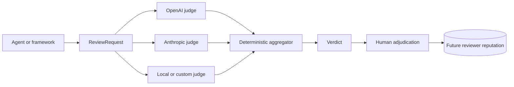

# AgentJury

[](https://github.com/madad-rashid/AgentJury/actions/workflows/tests.yml)
[](https://www.python.org/)
[](LICENSE)

**Peer review for AI agents.**

Your agent says the task is finished. AgentJury asks independent, blind AI reviewers whether the work is good enough before you trust it.

Each reviewer votes ▲ approve, ▼ revise, or – abstain. AgentJury combines those opinions with deterministic rules. No final LLM gets a deciding vote.

```text
Controlled Institutional Private-Credit Pilot.md   +43
▲4 ▼1   score 8.7   consensus 80%   verified
```

AgentJury is framework-independent. The first live integration is Hermes, and the core protocol works with any system that can build a `ReviewRequest`.

## Looking for testers

AgentJury is in public alpha. I am looking for developers running real agent workflows who are willing to test the jury on completed tasks and report where it fails.

Useful feedback includes:

- the framework or agent you used
- the reviewer panel and models
- the verdict, latency, and approximate cost
- reviewer disagreements or false findings
- installation friction and integration problems

Open an issue at <https://github.com/madad-rashid/AgentJury/issues>. Please do not post proprietary task content or API keys.

## Quick start

Install the current public-alpha code directly from GitHub:

```bash
pip install "agentjury[all] @ git+https://github.com/madad-rashid/AgentJury.git"
```

Set `OPENAI_API_KEY` and `ANTHROPIC_API_KEY` in your environment or a local `.env` file, then review an agent output:

```bash
agentjury review task.md output.md
```

Example:

```text
▲2 ▼1  score 7.0  consensus 67%  diversity 67%  jury 3/3  verified
jury confidence index 35%  (heuristic, not a probability)

▲  8  accuracy/openai        Sourced figure, drivers accurately characterized.
▼  5  critic/anthropic       Citation has no year or report; one claim is unsupported.
▲  8  executive/openai       Concise and decision-ready.
```

Choose your own panel:

```bash
agentjury review task.md output.md \
  --panel accuracy:openai,critic:anthropic,evidence:anthropic,executive:openai
```

Run `agentjury roles` to see the built-in roles. Every verdict is saved to `.agentjury/verdicts/`.

## Architecture



AgentJury separates generation from verification. Reviewers see the task and output, but never see one another's votes before submitting their own.

## Design principles

- **Blind review.** Judges do not see other reviewers' opinions before voting.
- **Deterministic aggregation.** No model acts as a final arbiter.
- **Provider diversity.** A multi-provider jury cannot verify work from one provider's judges alone.
- **Strict quorum.** Failed calls and abstentions do not silently become approval.
- **No unilateral block.** A single reviewer cannot block a task by itself.
- **Auditable identity.** Requests, runs, reviews, reviewer configurations, and findings each have stable IDs.
- **Human adjudication.** Individual findings can be graded so reviewer reliability can later be measured from evidence rather than assumed.
- **Framework independence.** AgentJury reviews work produced elsewhere. It is not another agent framework.

## How a verdict is reached

Judges vote ▲ approve, ▼ revise, or – abstain. Abstentions are recorded but never counted as approval, and they count against quorum.

No single judge can block. `blocked` requires blocking findings from two different providers. One blocking finding downgrades the result to `needs_revision`.

A panel needs a quorum of voters, by default a strict majority of requested judges:

```text
1→1, 2→2, 3→2, 4→3, 5→3, 6→4
```

A panel built from several providers must also hear from at least two of them. Otherwise the status is `insufficient_jury` and the votes are informational only.

Each judge call has a timeout, one retry on provider error, and one repair round-trip if the reply is not valid JSON. A failed judge is recorded as an error and the rest of the panel continues.

Exit codes:

```text
0  verified
1  needs_revision
2  blocked
3  insufficient_jury
```

The confidence figure is a heuristic index, not a calibrated probability. The plan is to calibrate it against human adjudication once enough real data exists.

Judges treat everything they review as untrusted data. Instructions hidden inside an agent output are treated as content, not reviewer instructions. `tests/test_adversarial_live.py` attacks the jury with `examples/injected_output.md`; run it with `AGENTJURY_LIVE=1`.

## Adjudication

Reputation is designed to come from human grading of individual findings, not from treating an entire review as one correct or incorrect event.

```bash
agentjury verdicts --dir <where-verdicts-live>
agentjury adjudicate 9a9a900dc86b --judge critic/anthropic \
    --finding 1 wrong --finding 2 wrong --finding 3 correct \
    --verdict disagree --note "figure is in the cited source"
agentjury adjudicate 9a9a900dc86b --producer-verdict correct
```

Findings are numbered as displayed. Grades are written back into the verdict JSON as current state and appended as events to `adjudications.jsonl` in the same folder. The event log records who changed which finding, from what to what, when, and why.

Set `AGENTJURY_VERDICT_DIR` to avoid repeating `--dir`.

Identity hierarchy:

- `request_id`: the work being evaluated
- `run_id`: one jury execution of that request
- `review_id`: one judge's opinion
- `config_id`: the reviewer configuration used for future reputation measurement, including provider, model, role, prompt hash, and relevant parameters
- `finding.id`: one specific issue raised by a reviewer

Verdicts are saved as `<request_id>-<run_id>.json`.

## Custom roles

Give a jury domain expertise with a JSON file of `{"role_name": "description"}`:

```bash
agentjury review task.md output.md \
  --roles examples/roles.json \
  --panel accuracy:openai,domain_expert:anthropic,executive:openai
```

## Integrations

### Hermes Agent

`integrations/hermes/` contains the first live integration. It reviews substantial Hermes responses in the background, saves verdicts, writes verdict metadata into markdown frontmatter, and feeds major findings back on the next relevant turn.

See [integrations/hermes/README.md](integrations/hermes/README.md) for installation and configuration.

Adapters for other agent frameworks are welcome. See [CONTRIBUTING.md](CONTRIBUTING.md).

## Protocol

Current schema: **0.5**.

Print the schemas with:

```bash
agentjury schema request
agentjury schema verdict
```

The main objects are:

- `ReviewRequest`: task, agent output, optional context and artifacts, task type, domain, and producer metadata
- `Review`: one independent judge opinion with vote, score, reason, findings, IDs, reviewer configuration, telemetry, and adjudication slots
- `Verdict`: deterministic aggregate with votes, score, consensus, diversity, confidence index, status, and the underlying reviews

Every field needed by the planned reputation system is recorded from the first review. Reputation weighting is not active yet.

## Development

See [CONTRIBUTING.md](CONTRIBUTING.md) for local setup, tests, judge-provider adapters, framework integrations, and pull requests.

See [docs/PUBLISHING.md](docs/PUBLISHING.md) for the release and PyPI checklist.

## Status

Public alpha. The core aggregation rules are intentionally stable while real verdicts are collected through the Hermes integration and direct CLI use.

The next research step is reviewer reputation by task type using human-adjudicated findings, followed by diversity weighting from observed disagreement patterns.

## Roadmap

- [x] Protocol schema
- [x] Judge interface with OpenAI and Anthropic adapters
- [x] Deterministic aggregator
- [x] CLI: `agentjury review task.md output.md`
- [x] Hermes integration
- [x] Review-event schema with telemetry and adjudication slots
- [x] Quorum, non-unilateral blocking, prompt-injection defence, custom roles
- [x] Abstain vote, provider floor, retry, repair, timeouts, CI
- [x] Human finding-level adjudication and append-only adjudication history
- [ ] PyPI release
- [ ] Additional judge providers and local-model adapter
- [ ] Reviewer reputation by task type, weighted by human agreement over time
- [ ] Jury diversity weighting from historical disagreement
- [ ] Calibrated confidence from observed outcomes

## License

MIT
