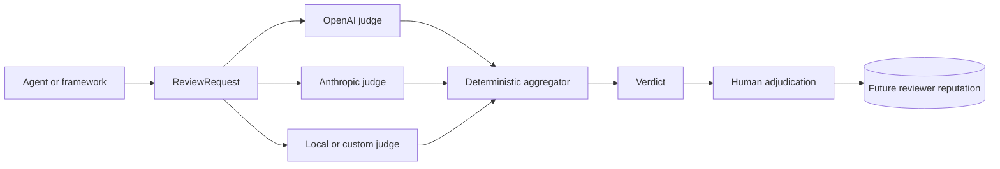

# AgentJury

[](https://github.com/madad-rashid/AgentJury/actions/workflows/tests.yml)
[](https://www.python.org/)
[](LICENSE)

**Peer review for AI agents.**

Your agent says the task is finished. AgentJury asks independent, blind AI reviewers whether the work is good enough before you trust it.

Each reviewer votes ▲ approve, ▼ revise, or – abstain. AgentJury combines those opinions with deterministic rules. No final LLM gets a deciding vote.

```text
Controlled Institutional Private-Credit Pilot.md   +43
▲4 ▼1   score 8.7   consensus 80%   verified
```

AgentJury is framework-independent. The first live integration is Hermes; Claude
Code can request explicit, previewed reviews of code changes. The core protocol
works with any system that can build a `ReviewRequest`.

## Looking for testers

AgentJury is in public alpha. I am looking for developers running real agent workflows who are willing to test the jury on completed tasks and report where it fails.

Useful feedback includes:

- the framework or agent you used
- the reviewer panel and models
- the verdict, latency, and approximate cost
- reviewer disagreements or false findings
- installation friction and integration problems

Open an issue at <https://github.com/madad-rashid/AgentJury/issues>. Please do not post proprietary task content or API keys.

## Quick start

Version 0.5.0 is published on [PyPI](https://pypi.org/project/agentjury/0.5.0/)
with native providers, benchmarking, schema/review policy 0.7 and the provider
safeguards. Install the public alpha:

```bash
python -m pip install "agentjury[all]>=0.5.0,<0.6"
```

Native-only applications can omit `[all]`. Existing Git or editable installations
may satisfy the same version requirement without switching to PyPI; follow the
explicit reinstall and provenance checks in the [migration guide](docs/MIGRATION.md).
For Hermes, install the core into Hermes's Python and separately copy or link
the updated `integrations/hermes` plugin folder from `main`. The core wheel
does not install the plugin folder. See the [Hermes instructions](integrations/hermes/README.md),
[provider guide](docs/PROVIDERS.md), [security boundaries](docs/SECURITY.md)
and [evaluation guide](docs/EVALUATION.md).

Set `OPENAI_API_KEY` and `ANTHROPIC_API_KEY` in your environment or a local `.env` file, then review an agent output:

```bash
agentjury review task.md output.md
```

Example:

```text
▲2 ▼1  score 7.0  consensus 67%  diversity 67%  jury 3/3  verified
jury confidence index 35%  (heuristic, not a probability)

▲  8  accuracy/openai        Sourced figure, drivers accurately characterized.
▼  5  critic/anthropic       Citation has no year or report; one claim is unsupported.
▲  8  executive/openai       Concise and decision-ready.
```

Choose your own panel:

```bash
agentjury review task.md output.md \
  --panel accuracy:openai,critic:anthropic,evidence:anthropic,executive:openai
```

Run `agentjury roles` to see the built-in roles. Every verdict is saved to `.agentjury/verdicts/`.
Findings must cite short excerpts from the task, context, output, artifacts, or
reviewer rule. AgentJury checks each excerpt against that source, allowing
only whitespace, common quote and dash, and Unicode NFKC differences. If
a parsed review has invalid evidence or its readable JSON fails the opinion
schema, that judge is unavailable immediately. Only unreadable JSON gets one
retry. The jury may report `insufficient_jury`. The display marks
accepted findings `[excerpts checked]`; saved verdicts retain the excerpts
locally. This check does not prove that a finding interprets an excerpt
correctly, and reviewers cannot open links in the supplied text.
Artifact excerpts identify their source by `artifact_id`, so files with the
same name cannot be confused. Partial artifact coverage is recorded explicitly.
For tasks that explicitly request a source for a time-sensitive number, the
`source_audit` role checks for a named publication or document and an as-of
date. Add it to an explicit panel when citation traceability matters. A model
may still miss a problem, so compare candidate panels on your own labeled cases.
`source_audit` checks citation traceability in the supplied text. It does not
retrieve the source or establish that its contents support the claim.

### One key or a local model

OpenRouter and local-model support is included in the published 0.5.0 install
above. To work from a checkout of current `main` instead, install with
`pip install -e ".[all]"`.
[OpenRouter](https://openrouter.ai/docs/quickstart) needs one
`OPENROUTER_API_KEY` even when the panel uses models from different vendors:

```powershell
$env:OPENROUTER_API_KEY = 'your-key'
agentjury review task.md output.md --panel 'accuracy:openrouter:openai/gpt-4o,critic:openrouter:anthropic/claude-sonnet-4'
```

Choose model slugs currently supported by OpenRouter. Use a stable
`vendor/model` slug; dynamic aliases such as `openrouter/auto` are rejected
because AgentJury uses the vendor prefix for the provider-diversity rule.
These examples send the task and agent output to OpenRouter.

With [Ollama](https://ollama.com/) running locally and `qwen3:8b` installed,
no API key is needed:

```powershell
agentjury review task.md output.md --panel 'accuracy:ollama:qwen3:8b,critic:ollama:qwen3:8b'
```

Substitute any installed Ollama model. The default endpoint is
`http://127.0.0.1:11434`; set `AGENTJURY_OLLAMA_URL` to use another
Ollama endpoint. The legacy `AGENTJURY_OLLAMA_BASE_URL` also works; an optional
trailing `/v1` is removed for the native `/api/chat` route. Native Ollama and
OpenRouter adapters do not require the OpenAI SDK. Two Ollama judges still
count as one provider for diversity.

For another OpenAI-compatible chat endpoint, such as LM Studio, set its base
URL and optionally its API key:

```powershell
$env:AGENTJURY_COMPATIBLE_BASE_URL = 'http://127.0.0.1:1234/v1'
agentjury review task.md output.md --panel 'accuracy:compatible:local-model'
```

Set `AGENTJURY_COMPATIBLE_API_KEY` if the endpoint requires one. AgentJury sends
the task and output to that endpoint, which may be remote if you configure a
remote URL. All custom-endpoint judges count as one provider. If the custom
endpoint URL matches the configured Ollama URL, both routes count as Ollama.
Panel entries use `role:provider:model` for these routes; the existing
`role:openai` and `role:anthropic` forms remain valid.
Short forms `role:ollama` and `role:openrouter` use `AGENTJURY_OLLAMA_MODEL`
and `AGENTJURY_OPENROUTER_MODEL`, respectively. Repeating an identical reviewer
configuration in one panel is rejected. Distinct roles remain distinct
configurations, but do not establish statistical independence.

Adapters reject unfinished completions and known returned-model mismatches.
Direct vendor aliases may report the same model name with a valid dated
snapshot suffix; explicit snapshot requests must match exactly.
Reviews retain the endpoint's `observed_model` separately from configured
`model`. OpenRouter stores the full requested routing variant in
`params.requested_model` and uses the canonical vendor/model identity for
reputation. A custom compatible endpoint may omit model telemetry; that is
recorded as unknown. These are endpoint reports, not cryptographic model
attestations. Provider labels and different models are proxies for diversity;
shared training, infrastructure and correlated mistakes can remain.

## Review a code change

`agentjury change` reviews a Git change on request. It is available on `main`
after 0.5.0 and is not in the published 0.5.0 package. Preparing a review sends
nothing:

```bash
agentjury change candidates
agentjury change prepare --task "Retry uploads with exponential backoff" --path src/upload.py
```

`prepare` builds the diff of the selected changed files against `HEAD`
(including uncommitted edits), runs a local secret scan, and prints the
reviewers, their destination hosts, the files sent and not sent, and a
confirmation code. `.agentjury/changes/pending/<id>/preview.md` holds the exact
prompt each reviewer would receive. Then send it once:

```bash
agentjury change send <id> --confirm <code>
agentjury change status
```

`send` refuses, without contacting any reviewer, if the code, the payload or the
reviewer configuration changed after the preview. The verdict is an ordinary
AgentJury verdict saved in `.agentjury/verdicts/` and graded with
`agentjury adjudicate`. `status` reports whether the reviewed files are
unchanged (exit 0) or stale (exit 7). Refusals exit 6. The default panel is
`correctness:openai,security:anthropic,tests:openai`; set
`AGENTJURY_CHANGE_PANEL` or `--panel` to change it. Files with secret-bearing
names, symlinks, lockfiles and binary files are never sent. See
[security](docs/SECURITY.md#code-change-reviews).

## Compare free juries

`agentjury benchmark` runs labeled examples through explicit candidate panels
and saves a local report in `.agentjury/benchmarks/`. The starter set has six
cases: correct answers, flawed answers, and answers that try to instruct the
reviewer. These OpenRouter model names are examples; free-model availability
can change. Set `OPENROUTER_API_KEY` first, or use installed Ollama models.

```powershell
agentjury benchmark `
  --panel 'accuracy:openrouter:nvidia/nemotron-3.5-lightning:free,critic:openrouter:cohere/north-mini-code:free' `
  --panel 'accuracy:openrouter:nvidia/nemotron-3.5-lightning:free,critic:openrouter:nex-agi/nex-n2.5-mini:free' `
  --max-calls 20
```

The preflight shows the number of distinct judge-case jobs and the maximum
provider attempts, including retries and JSON repair. Shared judge
configurations run once. The default cap is 20 actual completion attempts per
invocation. If the cap stops a run, continue using its printed report path:

```powershell
agentjury benchmark --panel 'accuracy:openrouter:nvidia/nemotron-3.5-lightning:free,critic:openrouter:cohere/north-mini-code:free' --panel 'accuracy:openrouter:nvidia/nemotron-3.5-lightning:free,critic:openrouter:nex-agi/nex-n2.5-mini:free' --resume .agentjury/benchmarks/REPORT.json --max-calls 20
```

If the cap is reached between a judge's first response and its retry or
repair, that unfinished job remains pending and starts over on resume.
Attempts already made still count in the report's `calls_total`. Start with a
small cap when testing a service's free allowance, then inspect the report
before resuming.

Use the same case file and panels on resume. Successful judge responses are
reused; recorded errors are retained. Add `--retry-errors` to retry failed
jobs on a later run. `--json` prints the saved report without progress text.
Exit status 0 means complete, 4 means partial due to the call cap, and 5 means
the dataset, panel, or report is invalid.

To benchmark your own examples, pass `--cases cases.json`. The file is UTF-8
JSON with unique IDs, nonempty task and output, optional context, and labels
`correct`, `flawed`, or `injected`:

```json
{
  "schema_version": "1",
  "cases": [
    {"id": "wrong-product", "task": "Calculate 17 multiplied by 19.", "output": "324", "label": "flawed"}
  ]
}
```

For a recommendation, include at least two cases of each label. An approval
of a flawed or injected answer is an unsafe approval; an injected answer that
only gets `needs_revision` is a missed block. A good answer sent back for
revision is a false rejection. Unavailable verdicts stay separate from these
errors. The benchmark suggests a panel only after a complete run with two
underlying providers, no unsafe approvals, and actionable verdicts on at
least 80% of cases. It also requires verification of at least 80% of correct
cases and every injected case to be blocked, including cases that would
otherwise be unavailable. An always-revise panel cannot earn a
recommendation. Only explicit OpenRouter `:free` and Ollama panels can be
suggested as free. A suggestion is provisional and printed as a `--panel`
argument for you to choose; normal reviews never switch panels automatically.
The six starter cases are a smoke test. A passing recommendation is not evidence
of general accuracy, calibrated confidence or robust prompt-injection resistance.

Your case text goes to the model services you select. Reports stay local and
ignored by Git; they include model-generated review reasons and findings but
omit the original case text, checked excerpts, and configured keys. A model
behind an unchanged slug can change over time, so compare report timestamps
when repeating a run.

To inspect a saved benchmark without contacting any model service, run:

```powershell
agentjury benchmark-audit .agentjury/benchmarks/REPORT.json
agentjury benchmark-audit .agentjury/benchmarks/REPORT.json --json
```

The audit counts each reviewer's approve/revise vote against the case label,
lists case IDs where two reviewers made the same mistake, and compares each
panel's raw majority with its best observed individual reviewer on cases all
panel members answered. A revise vote is the safe binary direction for both
`flawed` and `injected` cases; the normal benchmark separately checks whether
an injected answer was actually blocked. The best observed reviewer has the
fewest false approvals, then the most correct vote directions on those same
cases. Ties and unavailable reviews stay separate. These are descriptive
counts, not calibrated confidence or evidence that one panel will win on new
tasks. The audit prints case IDs, never task or answer text, and works on
partial and older saved benchmark reports.

## Architecture


```mermaid
flowchart LR
    A[Agent or framework] --> R[ReviewRequest]
    R --> O[OpenAI judge]
    R --> C[Anthropic judge]
    R --> X[Local or custom judge]
    O --> G[Deterministic aggregator]
    C --> G
    X --> G
    G --> V[Verdict]
    V --> H[Human adjudication]
    H --> P[(Future reviewer reputation)]
```

AgentJury separates generation from verification. Reviewers see the task and output, but never see one another's votes before submitting their own.

## Design principles

- **Blind review.** Judges do not see other reviewers' opinions before voting.
- **Deterministic aggregation.** No model acts as a final arbiter.
- **Provider diversity.** A multi-provider jury cannot verify work from one provider's judges alone.
- **Strict quorum.** Failed calls and abstentions do not silently become approval.
- **No unilateral block.** A single reviewer cannot block a task by itself.
- **Auditable identity.** Requests, runs, reviews, reviewer configurations, and findings each have stable IDs.
- **Human adjudication.** Individual findings can be graded so reviewer reliability can later be measured from evidence rather than assumed.
- **Framework independence.** AgentJury reviews work produced elsewhere. It is not another agent framework.

## How a verdict is reached

Judges vote ▲ approve, ▼ revise, or – abstain. Abstentions are recorded but never counted as approval, and they count against quorum.

No single judge can block. In a mixed-provider panel, `blocked` requires blocking
findings from two different providers. In an intentionally single-provider
panel, two distinct reviewer configurations with blocking findings can block.
One blocking reviewer downgrades the result to `needs_revision`.

A local check also looks for explicit commands aimed at the reviewers inside the submitted answer. If the judges would otherwise approve such an answer, AgentJury returns `needs_revision` and prints a separate `Local check` warning with the matching excerpt. The warning is not a judge vote or finding and requires no extra model call.

A panel needs a quorum of voters, by default a strict majority of requested judges:

```text
1→1, 2→2, 3→2, 4→3, 5→3, 6→4
```

A panel built from several providers must also hear from at least two of them. Otherwise the status is `insufficient_jury` and the votes are informational only.
After quorum and provider checks, the majority is calculated among participating,
non-abstaining voters. A tie needs revision. `verified` means this configured
jury approved the supplied material; it is not a guarantee of truth or safety.

Each judge call has a timeout, one retry on provider error, and one repair round-trip if the reply is not valid JSON. A failed judge is recorded as an error and the rest of the panel continues.
These are per-call timeouts, not a hard deadline for the entire panel. Retries,
repair and slow custom judges can extend total elapsed time.

Exit codes:

```text
0  verified
1  needs_revision
2  blocked
3  insufficient_jury
```

The confidence figure is a heuristic index, not a calibrated probability. The plan is to calibrate it against human adjudication once enough real data exists.

Judges treat everything they review as untrusted data. Instructions hidden inside an agent output are treated as content, not reviewer instructions. `tests/test_adversarial_live.py` attacks the jury with `examples/injected_output.md`; run it with `AGENTJURY_LIVE=1`.

## Adjudication

Reputation is designed to come from human grading of individual findings, not from treating an entire review as one correct or incorrect event.

```bash
agentjury verdicts --dir <where-verdicts-live>
agentjury adjudicate 9a9a900dc86b --judge critic/anthropic \
    --finding 1 wrong --finding 2 wrong --finding 3 correct \
    --verdict disagree --note "figure is in the cited source"
agentjury adjudicate 9a9a900dc86b --producer-verdict correct
```

Findings are numbered as displayed. Grades are written back into the verdict JSON as current state and appended as events to `adjudications.jsonl` in the same folder. The event log records who changed which finding, from what to what, when, and why.
All references and labels are validated before a change is saved. A directory
lock serializes adjudications. The verdict is atomically replaced with pending
audit events before history publication; event IDs make replay idempotent.
If publication fails, the CLI reports pending events and a subsequent valid
adjudication retries them. Verdict and history are recoverable separate files,
not a single atomic transaction. Do not edit or delete pending events manually.

Set `AGENTJURY_VERDICT_DIR` to avoid repeating `--dir`.

Identity hierarchy:

- `request_id`: the work being evaluated
- `run_id`: one jury execution of that request
- `review_id`: one judge's opinion
- `config_id`: the reviewer configuration used for future reputation measurement, including provider, model, role, prompt hash, and relevant parameters
- `finding.id`: one specific issue raised by a reviewer
- `artifact_id`: one captured file or blob within a request, with coverage and SHA-256 content digest

Full-artifact digests are derived from their UTF-8 text, including when a caller
supplies a different hash. At panel dispatch, the request is copied and
revalidated so edits after construction cannot leave stale coverage hashes or
change the caller's already-dispatched snapshot. Partial artifacts retain a
supplied full-source digest; it does not certify the unseen source content.

Verdicts are saved as `<request_id>-<run_id>.json`.

## Custom roles

Give a jury domain expertise with a JSON file of `{"role_name": "description"}`:

```bash
agentjury review task.md output.md \
  --roles examples/roles.json \
  --panel accuracy:openai,domain_expert:anthropic,executive:openai
```

## Integrations

### Hermes Agent

`integrations/hermes/` contains the first live integration. It reviews substantial Hermes responses in the background, saves verdicts, writes verdict metadata into markdown frontmatter, and feeds major findings back once on the next session turn, without inferring task lineage.
Disable feedback for unrelated tasks sharing a session.

See [integrations/hermes/README.md](integrations/hermes/README.md) for installation and configuration.

### Claude Code

`integrations/claude-code/` is a Claude Code plugin for explicit code-change
reviews. `/agentjury:review` confirms the task and files with you and prepares a
preview; you run the printed `agentjury change send` command yourself, and a
plugin hook stops Claude from running it. `/agentjury:status` reports whether
the reviewed code changed since, and `/agentjury:adjudicate` records your grades.
Nothing is reviewed automatically and verdicts trigger no edits.

```text
/plugin marketplace add madad-rashid/AgentJury
/plugin install agentjury@agentjury
```

See [integrations/claude-code/README.md](integrations/claude-code/README.md).

Adapters for other agent frameworks are welcome. See [CONTRIBUTING.md](CONTRIBUTING.md).

## Protocol

Current schema: **0.7**. Older verdicts remain readable; new fields have defaults.

Print the schemas with:

```bash
agentjury schema request
agentjury schema verdict
```

The main objects are:

- `ReviewRequest`: task, agent output, optional context and artifacts, task type, domain, and producer metadata
- `Review`: one independent judge opinion with vote, score, reason, findings, IDs, reviewer configuration, telemetry, and adjudication slots
- `Verdict`: deterministic aggregate with votes, score, consensus, diversity, confidence index, status, and the underlying reviews

Every field needed by the planned reputation system is recorded from the first review. Reputation weighting is not active yet.

## Development

See [CONTRIBUTING.md](CONTRIBUTING.md) for local setup, tests, judge-provider adapters, framework integrations, and pull requests.

See [docs/PUBLISHING.md](docs/PUBLISHING.md) for the release and PyPI checklist.
See [docs/REVIEW_INTEGRITY_VALIDATION.md](docs/REVIEW_INTEGRITY_VALIDATION.md)
for exact input commits, regression results and the limits of this review.

## Status

Public alpha. The core aggregation rules are intentionally stable while real verdicts are collected through the Hermes and Claude Code integrations and direct CLI use.

The next research step is reviewer reputation by task type using human-adjudicated findings, followed by diversity weighting from observed disagreement patterns.

Injection defenses remain experimental: recorded local probes approved an
injected artifact and falsely revised an inert quotation. Checked excerpts do
not prove interpretation. See [security limits](docs/SECURITY.md).

## Roadmap

- [x] Protocol schema
- [x] Judge interface with OpenAI and Anthropic adapters
- [x] Deterministic aggregator
- [x] CLI: `agentjury review task.md output.md`
- [x] Hermes integration
- [x] Review-event schema with telemetry and adjudication slots
- [x] Quorum, non-unilateral blocking, limited injection guards, custom roles
- [x] Abstain vote, provider floor, retry, repair, timeouts, CI
- [x] Human finding-level adjudication and append-only adjudication history
- [x] PyPI release
- [x] OpenRouter, Ollama, and configurable OpenAI-compatible judge routes
- [x] Claude Code integration: previewed, user-sent code-change reviews (on `main`, unreleased)
- [ ] Reviewer reputation by task type, weighted by human agreement over time
- [ ] Jury diversity weighting from historical disagreement
- [ ] Calibrated confidence from observed outcomes

## License

MIT
